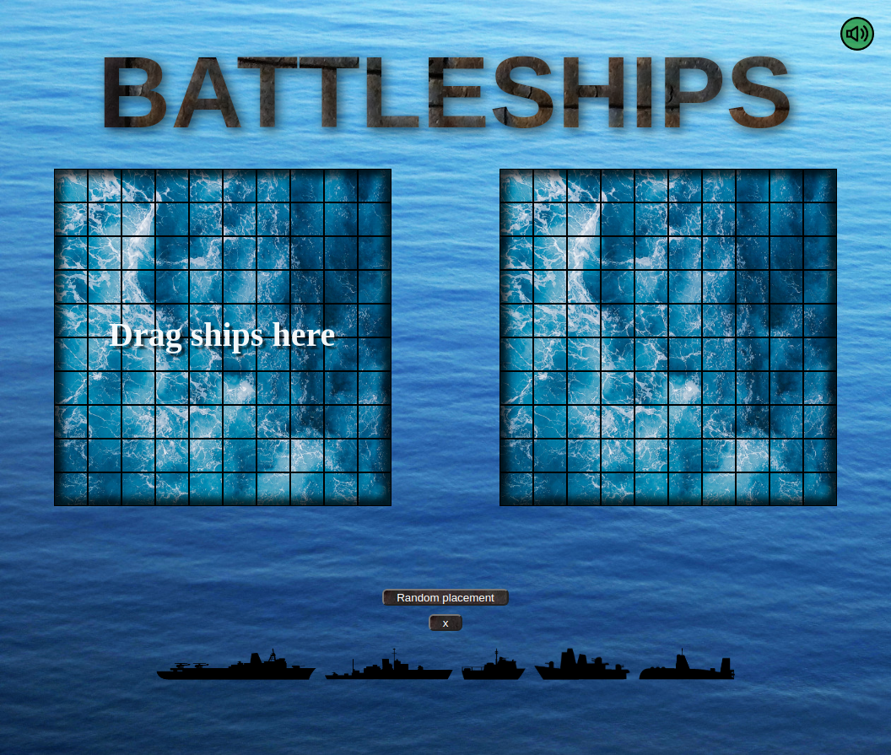
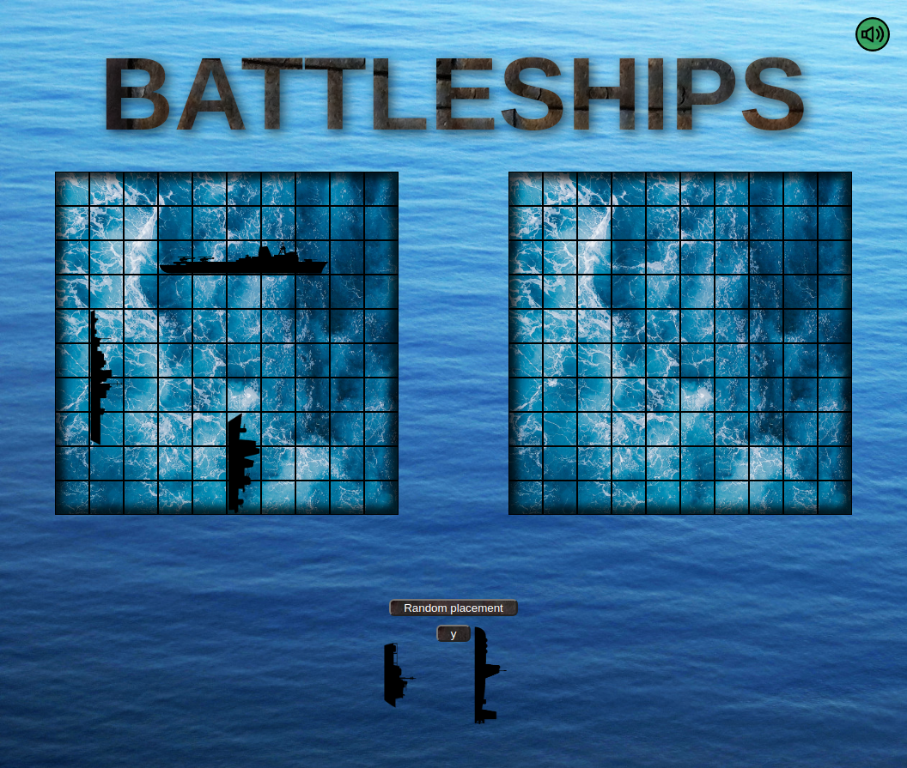
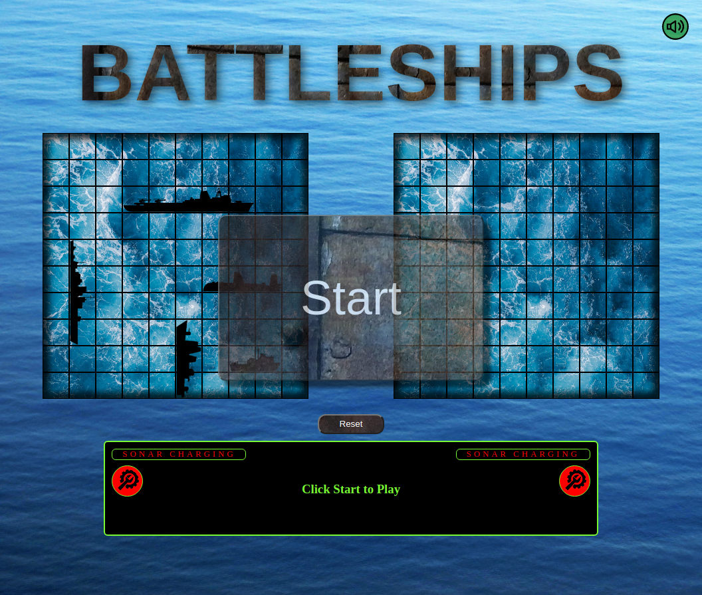
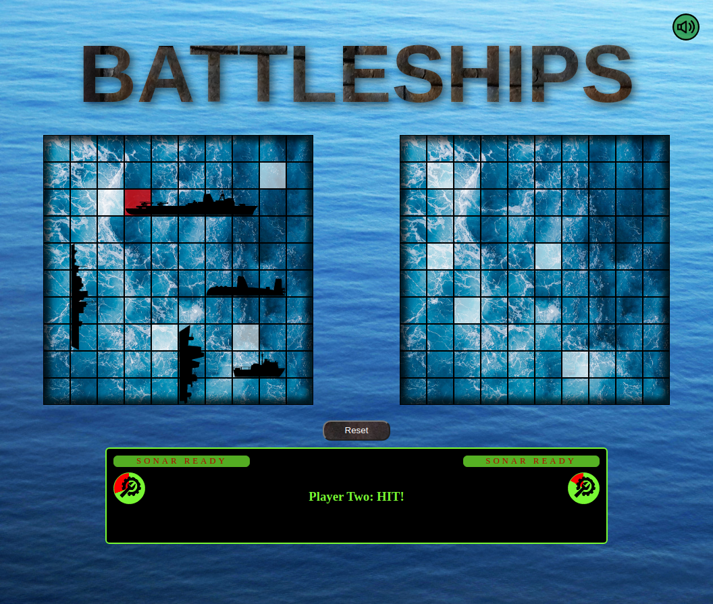
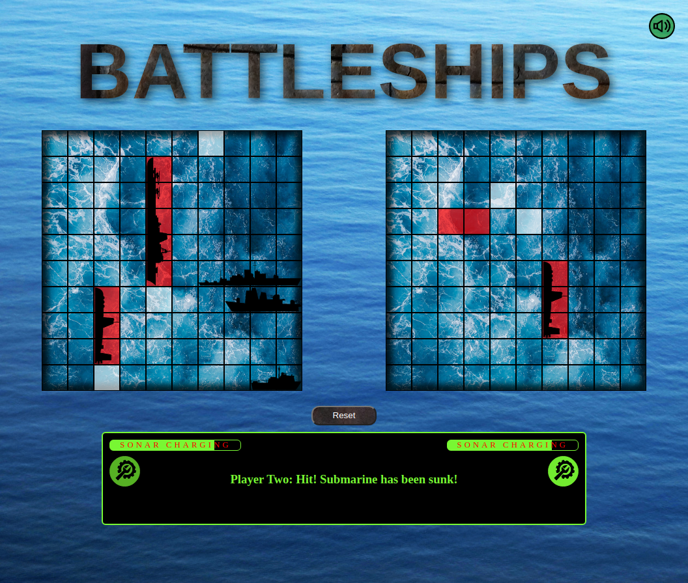

<!-- Improved compatibility of back to top link: See: https://github.com/othneildrew/Best-README-Template/pull/73 -->

[![Contributors][contributors-shield]][contributors-url]
[![Forks][forks-shield]][forks-url]
[![Stargazers][stars-shield]][stars-url]
[![Issues][issues-shield]][issues-url]
[![MIT License][license-shield]][license-url]
[![LinkedIn][linkedin-shield]][linkedin-url]

<!-- PROJECT LOGO -->
 

  

<h3 align="center">Battleship</h3>

  

    Battleship
     
    <a href="https://github.com/sirjamo1/Battleship"><strong>Explore the docs »</strong></a>
     
     
    <a href=" https://sirjamo1.github.io/Battleship/">View Demo</a>
    ·
    <a href="https://github.com/sirjamo1/Battleship/issues">Report Bug</a>
    ·
    <a href="https://github.com/sirjamo1/Battleship/issues">Request Feature</a>
  

<!-- TABLE OF CONTENTS -->

  
Table of Contents

  <ol>
    <li>
      <a href="#about-the-project">About The Project</a>
      <ul>
        <li><a href="#built-with">Built With</a></li>
      </ul>
    </li>
    <li><a href="#screenshots">Screenshots</a></li>
    <li><a href="#features">Features</a></li>
    <li><a href="#roadmap">Roadmap</a></li>
    <li><a href="#acknowledgments">Acknowledgments</a></li>
  </ol>

<!-- ABOUT THE PROJECT -->

## About The Project

Battleship was built for The Odin Project.

Link below for Project criteria.

https://www.theodinproject.com/lessons/node-path-javascript-battleship

<a href=" https://sirjamo1.github.io/Battleship/">Live preview link</a>

(<a href="#readme-top">back to top</a>)

### Built With

-   javaScript
-   jest
-   webPack
-   css

(<a href="#readme-top">back to top</a>)

<!-- USAGE EXAMPLES -->

## Screenshots

  
  
  
  

(<a href="#readme-top">back to top</a>)

## Features

-   Place ships on board by dragging/dropping (either horizontal or vertical)
-   Random placement for a quick game
-   Sonar
    -   Charges up over time
    -   Player one usage
        -   Reveals ships location with two blinks of opacity change
    -   Player twos usage
        -   Next shot is a guaranteed hit.
-   Wrench.
    -   Player one usage.
        -   Repairs whole ship which it is dragged/dropped on to
    -   Player Two usage
        -   Repairs a whole Random ship that has been hit
-   Text log
    -   Logs message after each move
    -   Type writer affect when logging
-   Sound
    -   Hit
    -   Miss
    -   Sunk ship
    -   Sonar
    -   Wrench
    -   Digital typewriter
-   Reset
    -   Resets whole game from any point

(<a href="#readme-top">back to top</a>)

<!-- ROADMAP -->

## Roadmap

-   May include a difficulty setting down the track.
    -   Would be adjusting how quickly sonar and wrench(repair) builds up (maybe also the opacity of the sonar)

See the [open issues](https://github.com/sirjamo1/Battleship/issues) for a full list of proposed features (and known issues).

(<a href="#readme-top">back to top</a>)

<!-- CONTACT -->

## Contact

James Howells -- jam_how@hotmail.com

Project Link: [https://github.com/sirjamo1/Battleship](https://github.com/sirjamo1/Battleship)

(<a href="#readme-top">back to top</a>)

<!-- ACKNOWLEDGMENTS -->

## Acknowledgments

-   Battleships from https://www.pngwing.com/en/free-png-bsgsf/download
-   Backgrounds
    -   water Photo by Magda Ehlers: https://www.pexels.com/photo/body-of-water-636353/
    -   water 2 Photo by bt3gl ♡: https://www.pexels.com/photo/aerial-shot-of-blue-water-3894157/
-   metal backgreound from https://pixabay.com/photos/surface-rivet-metal-facade-2754970/ (used by text)
-   sounds from https://www.freesound.org
-   favicon from https://www.flaticon.com/

(<a href="#readme-top">back to top</a>)

<!-- MARKDOWN LINKS & IMAGES -->
<!-- https://www.markdownguide.org/basic-syntax/#reference-style-links -->

[contributors-shield]: https://img.shields.io/github/contributors/sirjamo1/Battleship.svg?style=for-the-badge
[contributors-url]: https://github.com/sirjamo1/Battleship/graphs/contributors
[forks-shield]: https://img.shields.io/github/forks/sirjamo1/Battleship.svg?style=for-the-badge
[forks-url]: https://github.com/sirjamo1/Battleship/network/members
[stars-shield]: https://img.shields.io/github/stars/sirjamo1/Battleship.svg?style=for-the-badge
[stars-url]: https://github.com/sirjamo1/Battleship/stargazers
[issues-shield]: https://img.shields.io/github/issues/sirjamo1/Battleship.svg?style=for-the-badge
[issues-url]: https://github.com/sirjamo1/Battleship/issues
[license-shield]: https://img.shields.io/github/license/sirjamo1/Battleship.svg?style=for-the-badge
[license-url]: https://github.com/sirjamo1/Battleship/blob/master/LICENSE.txt
[linkedin-shield]: https://img.shields.io/badge/-LinkedIn-black.svg?style=for-the-badge&logo=linkedin&colorB=555
[linkedin-url]: https://linkedin.com/in/linkedin_username
[product-screenshot]: images/screenshot.png
[next.js]: https://img.shields.io/badge/next.js-000000?style=for-the-badge&logo=nextdotjs&logoColor=white
[next-url]: https://nextjs.org/
[react.js]: https://img.shields.io/badge/React-20232A?style=for-the-badge&logo=react&logoColor=61DAFB
[react-url]: https://reactjs.org/
[vue.js]: https://img.shields.io/badge/Vue.js-35495E?style=for-the-badge&logo=vuedotjs&logoColor=4FC08D
[vue-url]: https://vuejs.org/
[angular.io]: https://img.shields.io/badge/Angular-DD0031?style=for-the-badge&logo=angular&logoColor=white
[angular-url]: https://angular.io/
[svelte.dev]: https://img.shields.io/badge/Svelte-4A4A55?style=for-the-badge&logo=svelte&logoColor=FF3E00
[svelte-url]: https://svelte.dev/
[laravel.com]: https://img.shields.io/badge/Laravel-FF2D20?style=for-the-badge&logo=laravel&logoColor=white
[laravel-url]: https://laravel.com
[bootstrap.com]: https://img.shields.io/badge/Bootstrap-563D7C?style=for-the-badge&logo=bootstrap&logoColor=white
[bootstrap-url]: https://getbootstrap.com
[jquery.com]: https://img.shields.io/badge/jQuery-0769AD?style=for-the-badge&logo=jquery&logoColor=white
[jquery-url]: https://jquery.com
